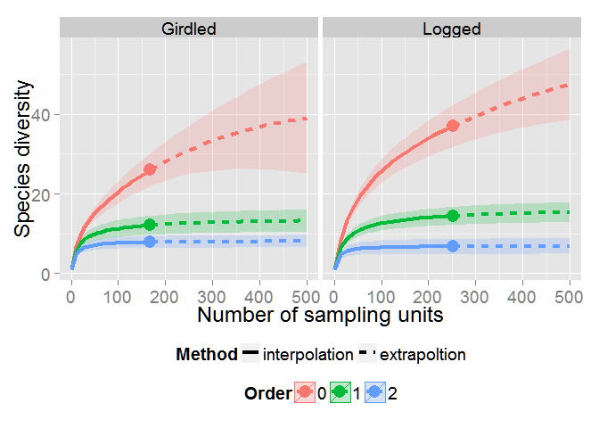
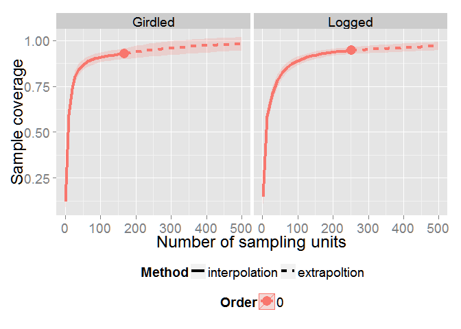
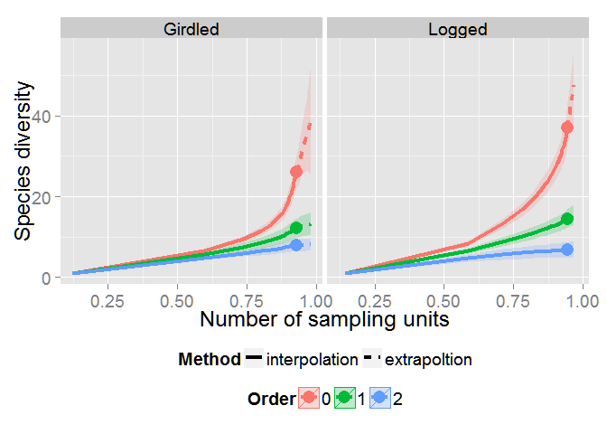

iNEXT
=====

The program iNEXT (iNterpolation and EXTrapolation) is a R package of
interpolation and extrapolation for species diversity.  
The user provides a vector of abundances of individual species
(abundance data) or incidences of individual species (incidence data).
iNEXT computes the species diversity estimates and associated 95%
confidence intervals.

### Run the development version

-   Required: [R](http://cran.rstudio.com/)
-   Suggested: [Rstudio](http://www.rstudio.com/ide/download/)

Start R(studio) and copy-and-paste the commands below:

        install.packages('devtools')
        library(devtools)
        install_github('iNEXT','JohnsonHsieh')
        library(iNEXT)

Remark that in order to install 'devtools' package, you should update R
to the last version. Further, to get install\_github() to work, you
should install the 'httr' package.

### Example

Copy-and-paste the commands below:

        library(iNEXT)
        data(spider)
        out <- iNEXT(spider, q=c(0, 1, 2), endpoint=500)
        ggiNEXT(out, type=1, facet.var="site")

        ggiNEXT(out, type=2, facet.var="site")

        ggiNEXT(out, type=3, facet.var="site")

### License

The iNEXT package is licensed under the GPLv3. See the files listed
below for additional details.

-   COPYING - radyant package license (GPLv3)
-   NOTICE - Copyright notices for additional included software
