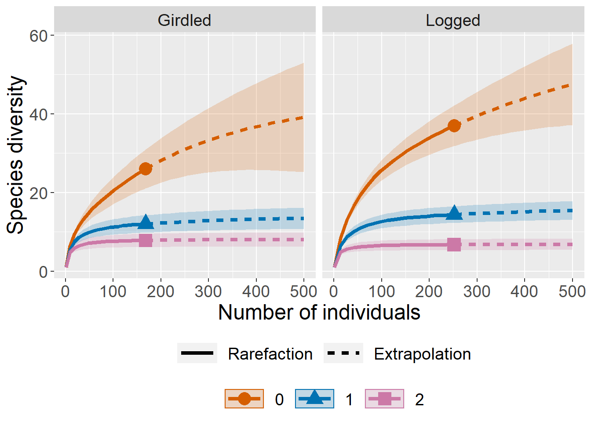
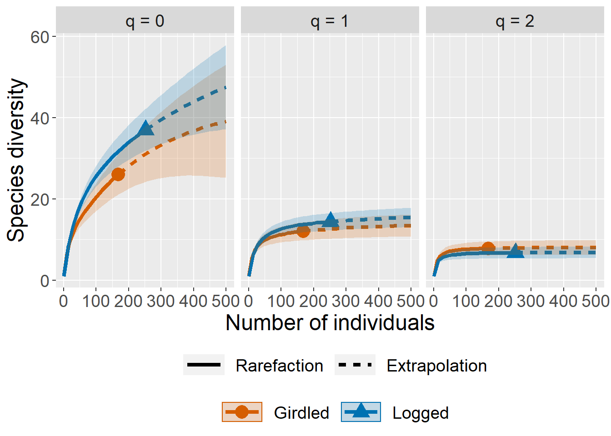
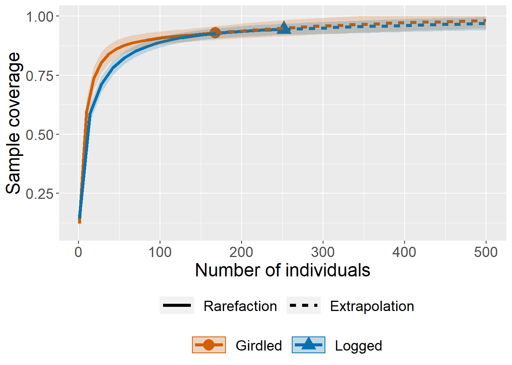
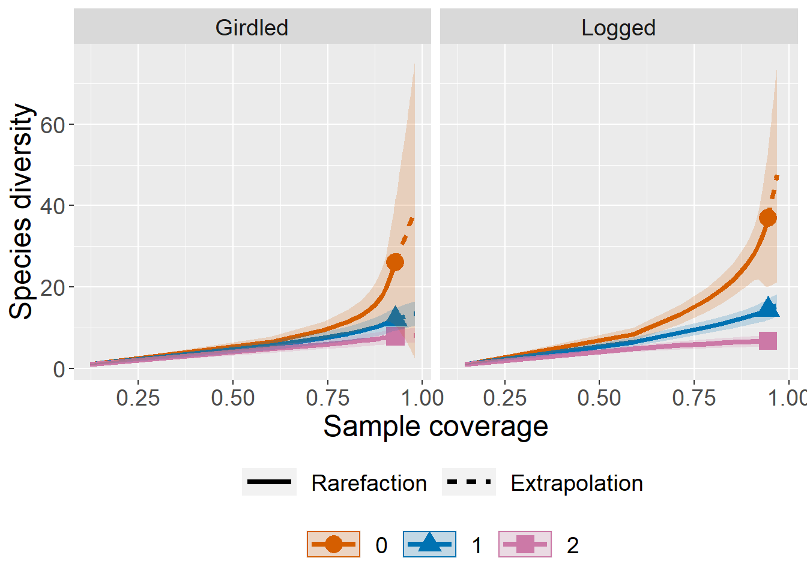
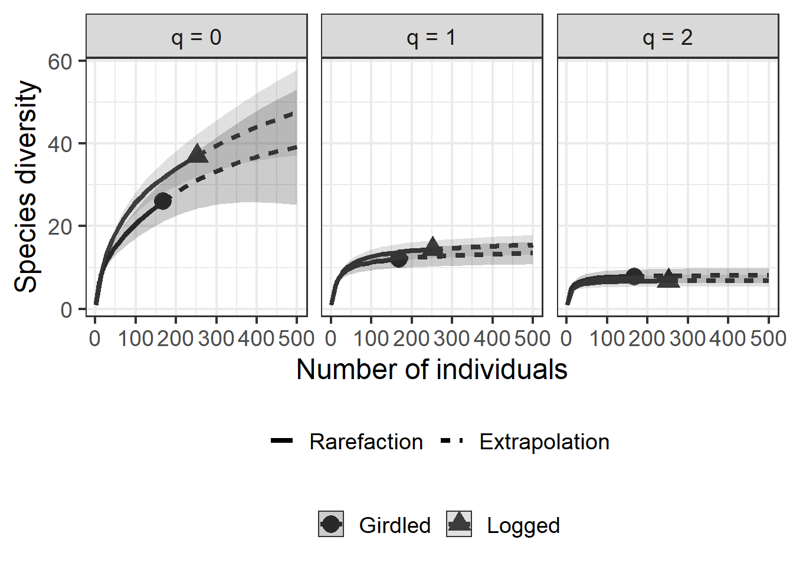

<!-- README.md is generated from README.Rmd. Please edit that file -->
iNEXT (R package)
=================

[](https://travis-ci.org/JohnsonHsieh/iNEXT) [](https://github.com/metacran/cranlogs.app)

<h5 align="right">
Latest version: Sept. 22, 2016
</h5>
<font color="394CAE">
<h3 color="394CAE" style="font-weight: bold">
Introduction to iNEXT (R package): Excerpt from iNEXT User’s Guide
</h3>
</font> <br>
<h5>
<b>Hsieh, T. C., K. H. Ma, and Anne Chao</b> <br><br> <i>Institute of Statistics, National Tsing Hua University, Hsin-Chu, Taiwan 30043</i>
</h5>
<br> iNEXT (iNterpolation and EXTrapolation) is an R package, available in [CRAN](https://cran.r-project.org/web/packages/iNEXT/index.html) and [Github](https://github.com/AnneChao), for rarefaction and extrapolation of species diversity (Hill numbers). Here we provide a quick introduction demonstrating how to run iNEXT, and showing three types of sampling curves. See Chao & Jost (2012), Colwell et al. (2012) and Chao et al. (2014) for methodologies. A short review of theoretical background and methods relevant to the package are included in an application paper by [Hsieh, Ma & Chao (2016)](http://chao.stat.nthu.edu.tw/wordpress/paper/120_pdf_appendix.pdf). An online version of iNEXT Online is also available for users without an R background. Detailed information about all functions in iNEXT is provided in the iNEXT Manual in CRAN and also in [iNEXT User’s Guide](http://chao.stat.nthu.edu.tw/wordpress/wp-content/uploads/software/iNEXT_UserGuide.pdf),both are available from [Anne Chao's website](http://chao.stat.nthu.edu.tw/wordpress/software_download/).

iNEXT focuses on three measures of Hill numbers of order q: species richness (q=0), Shannon diversity (q=1, the exponential of Shannon entropy) and Simpson diversity (q=2, the inverse of Simpson concentration). For each diversity measure, iNEXT uses the observed sample of abundance or incidence data (called the “reference sample”) to compute diversity estimates for rarefied and extrapolated samples and the associated 95% (default) confidence intervals as well as plot the following two types of rarefaction and extrapolation (R/E) curves:

1.  Sample-size-based R/E sampling curves: iNEXT computes diversity estimates for rarefied and extrapolated samples up to double the reference sample size (by default) or a user-specified size. This type of sampling curve plots the diversity estimates with respect to sample size. Sample size refers to the number of individuals in a sample for abundance data, whereas it refers to the number of sampling units for incidence data.

2.  Coverage-based R/E sampling curves: iNEXT computes diversity estimates for rarefied and extrapolated samples with sample completeness (as measured by sample coverage) up to the coverage value of double the reference sample size (by default) or a user-specified coverage. This type of sampling curve plots the diversity estimates with respect to sample coverage. In addition to the above two types of sampling curves, iNEXT also plots a sample completeness curve, which depicts how the sample coverage estimate varies as a function of sample size. The sample completeness curve can be thought of as a bridge connecting the afore-mentioned two types of curves.

### SOFTWARE NEEDED TO RUN INEXT IN R

-   Required: [R](http://cran.rstudio.com/)
-   Suggested: [RStudio IDE](http://www.rstudio.com/ide/download/)

### HOW TO RUN INEXT:

The iNEXT package is available on CRAN and can be downloaded with a standard installation procedure using the commands shown below. It can also be downloaded from the github. For a first-time installation, an additional visualization extension package (ggplot2) must be loaded.

``` r
## install iNEXT package from CRAN
install.packages("iNEXT")

## install iNEXT from github
install.packages('devtools')
library(devtools)
install_github('AnneChao/iNEXT')

## import packages
library(iNEXT)
library(ggplot2)
```

Remark: In order to install `devtools` package, you should update R to the last version. Further, to get `install_github` to work, you should install the `httr` package.

### MAIN FUNCTION: iNEXT()

The main function iNEXT() with default arguments is described below: <br><br> iNEXT(x, q=0, datatype="abundance", size=NULL, endpoint=NULL, knots=40, se=TRUE, conf=0.95, nboot=50) <br><br> This main function computes diversity estimates of order q, the sample coverage estimates and related statistics for K (if knots=K) evenly-spaced knots (sample sizes) between size 1 and the endpoint, where the endpoint is as described below. Each knot represents a particular sample size for which diversity estimates will be calculated. By default, endpoint is set to be double the reference sample size.

This function returns an "iNEXT" object which can be further used to make plots using the function ggiNEXT() to be described below.

<table class="gmisc_table" style="border-collapse: collapse; margin-top: 1em; margin-bottom: 1em;">
<thead>
<tr>
<th style="border-bottom: 1px solid grey; border-top: 2px solid grey; text-align: center;">
Argument
</th>
<th style="border-bottom: 1px solid grey; border-top: 2px solid grey; text-align: center;">
Description
</th>
</tr>
</thead>
<tbody>
<tr>
<td style="text-align: left;">
x
</td>
<td style="text-align: left;">
a matrix, data.frame, lists of species abundances/incidences, or lists of incidence frequencies (see data format/information below);
</td>
</tr>
<tr>
<td style="text-align: left;">
q
</td>
<td style="text-align: left;">
a number or vector specifying the diversity order(s) of Hill numbers;
</td>
</tr>
<tr>
<td style="text-align: left;">
datatype
</td>
<td style="text-align: left;">
type of input data, “abundance”, “incidence_raw”, or “incidence_freq”;
</td>
</tr>
<tr>
<td style="text-align: left;">
size
</td>
<td style="text-align: left;">
an integer vector of sample sizes for which diversity estimates will be computed. If NULL, then diversity estimates will be calculated for those sample sizes determined by the specified/default endpoint and knots;
</td>
</tr>
<tr>
<td style="text-align: left;">
endpoint
</td>
<td style="text-align: left;">
an integer specifying the sample size that is the endpoint for R/E calculation; If NULL, then endpoint=double the reference sample size;
</td>
</tr>
<tr>
<td style="text-align: left;">
knots
</td>
<td style="text-align: left;">
an integer specifying the number of equally-spaced knots (40, by default) between size 1 and the endpoint;
</td>
</tr>
<tr>
<td style="text-align: left;">
se
</td>
<td style="text-align: left;">
a logical variable to calculate the bootstrap standard error and confidence interval of a level specified by conf;
</td>
</tr>
<tr>
<td style="text-align: left;">
conf
</td>
<td style="text-align: left;">
a positive number < 1 specifying the level of confidence interval;
</td>
</tr>
<tr>
<td style="border-bottom: 2px solid grey; text-align: left;">
nboot
</td>
<td style="border-bottom: 2px solid grey; text-align: left;">
an integer specifying the number of bootstrap replications.
</td>
</tr>
</tbody>
</table>
This function returns an "iNEXT" object which can be further used to make plots using the function ggiNEXT() to be described below.

### DATA FORMAT/INFORMATION

Three types of data are supported: ("abundance", "incidence\_raw", or "incidence\_freq"):

1.  Individual-based abundance data (datatype="abundance"): Input data for each assemblage/site include sample species abundances in an empirical sample of n individuals (“reference sample”). When there are N assemblages, input data consist of an S by N abundance matrix, or N lists of species abundances.

2.  Sampling-unit-based incidence data: There are two kinds of input data.

(2a) Incidence-raw data (datatype="incidence\_raw"): for each assemblage, input data for a reference sample consist of a species-by-sampling-unit matrix; when there are N assemblages, input data consist of N lists of matrices, and each matrix is a species-by-sampling-unit matrix.

(2b) Incidence-frequency data (datatype="incidence\_freq"): input data for each assemblage consist of species sample incidence frequencies (row sums of each incidence matrix). When there are N assemblages, input data consist of an S+1 by N matrix, or N lists of species incidence frequencies. The first entry of each column/list must be the total number of sampling units, followed by the species incidence frequencies.

Four data sets (spider and bird for abundance data, and ant and ciliates for incidence data) are included in the iNEXT package for illustrating the data input formats and running procedures.

### BASIC GRAPHIC DISPLAYS: FUNCTION ggiNEXT()

The ggiNEXT() function, which extends ggplot2 to the "iNEXT" object, is described as follows with default arguments: <br><br> ggiNEXT(x, type=1, se=TRUE, facet.var="none", color.var="site", grey=FALSE) <br><br> Here x is an "iNEXT" object. Three types of curves are allowed: (1) Sample-size-based R/E curve (type=1) with confidence intervals (if se=TRUE). (2) Sample completeness curve (type=2) with confidence intervals (if se=TRUE). (3) Coverage-based R/E curve (type=3) with confidence intervals (if se=TRUE). <br><br> The argument facet.var ("none", "order", "site" or "both") is used to create a separate plot for each value of the specified variable. When facet.var="both", we can further use the argument color.var ("none", "order", "site" or "both") to display curves in a different color for each of the values of the specified variable. The user may also use the argument grey=TRUE to plot black/white figures.

### RAREFACTION/EXTRAPOLATION FOR SPIDER DATA (ABUNDANCE DATA)

``` r
data(spider)
out <- iNEXT(spider, q=c(0, 1, 2), datatype="abundance", endpoint=500)
# Sample-size-based R/E curves, separating plots by "site"
ggiNEXT(out, type=1, facet.var="site")
```



``` r
# Sample-size-based R/E curves, separating plots by "order"
ggiNEXT(out, type=1, facet.var="order")
```

 <br> To link the sample-sized and coverage-based sampling curves, it would be informative to first examine the sample completeness curve using the following command:

``` r
ggiNEXT(out, type=2)
```

 <br> The following commands return the coverage-based R/E sampling curves. The argument facet.var="site" in the ggiNEXT() function creates a separate plot for each site, as shown below:

``` r
ggiNEXT(out, type=3, facet.var="site")
```

 <br> The argument facet.var="order" creates a separate plot for each diversity order, and within each plot, as shown below.

``` r
ggiNEXT(out, type=3, facet.var="order")
```

 <br> The above graphical displays depict the typical color plots to standardize biodiversity samples in order to compare equally-large (sample-size-based) or equally-complete (coverage-based) samples. More graphic display options are described below.

``` r
# Separating plots by "order", and display black-white plots
ggiNEXT(out, type=1, facet.var="order", grey=TRUE)
```

 <br> More details and examples/options are provided in the iNEXT Manual in CRAN, and also in [iNEXT User’s Guide](http://chao.stat.nthu.edu.tw/wordpress/wp-content/uploads/software/iNEXT_UserGuide.pdf). Both are available from [Anne Chao's website](http://chao.stat.nthu.edu.tw/wordpress/software_download/).

### How to cite

<i>If you publish your work based on results from iNEXT (R package), please make reference to Hsieh et al. (2016) and Chao et al. (2014) given in the following list. </i>

### Referance

Chao, A., Gotelli, N.J., Hsieh, T.C., Sander, E.L., Ma, K.H., Colwell, R.K. & Ellison, A.M. (2014) Rarefaction and extrapolation with Hill numbers: a framework for sampling and estimation in species diversity studies. Ecological Monographs, 84, 45–67.

Chao, A. & Jost, L. (2012) Coverage-based rarefaction and extrapolation: standardizing samples by completeness rather than size. Ecology, 93, 2533–2547.

Colwell, R.K., Chao, A., Gotelli, N.J., Lin, S.-Y., Mao, C.X., Chazdon, R.L. & Longino, J.T. (2012) Models and estimators linking individual-based and sample-based rarefaction, extrapolation and comparison of assemblages. Journal of Plant Ecology, 5, 3–21.

Hsieh, T.C., Ma, K.H. & Chao, A. (2016) iNEXT: An R package for interpolation and extrapolation of species diversity (Hill numbers). To appear in Methods in Ecology and Evolution.
